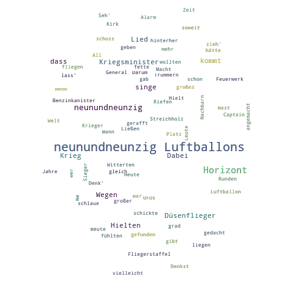
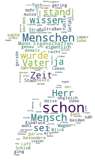

[](http://quantlet.de/)

## [](http://quantlet.de/) **SL_20190404_Wordcloud** [](http://quantlet.de/)

```yaml

Name of Quantlet: SL_20190404_Wordcloud
 
Published in: Statistical Learning Class (AAU Klagenfurt 2019)
  
Description: Creates a word cloud for one of the three given texts (an Austrian novel - "Der Mann ohne Eigenschaften" by Robert Musil, a songtext - "99 Luftballons" by Nena or a poem - "Gemeinsam" by Hanna Schnyders) in the shape of a man with hat, a balloon or a star. A word cloud is a data visualization technique used for representing text data in which the size of each word indicates its frequency or importance.

Keywords: Wordcloud, nltk, stopwords, mask, numpy, Python, text data, frequency, data visualization, natural language processing
     
Author: Anna Pacher, Patrick Plum, Kathrin Spendier

```







### PYTHON Code
```python

# -*- coding: utf-8 -*-
"""
Created on Wed Apr  3 08:34:12 2019

@author: Anna Pacher, Patrick Plum, Kathrin Spendier
"""

# importing the necessery modules 

from wordcloud import WordCloud
import matplotlib.pyplot as plt 
import csv
import os
from os import path
from PIL import Image
import numpy as np
import nltk
nltk.download('stopwords')

from nltk.corpus import stopwords

# Please change the working directory to your path!
root_path = os.getcwd()

#import german stopwords (these are words that will be excluded from the wordcloud,
#for instance articles and prepositions)
stopwords = stopwords.words('german')


# file object is created 
# here it can be chosen which text should be displayed

file_ob = open(path.join(root_path, 'musil.txt'), encoding='utf-8') 
#file_ob = open(path.join(root_path, '99Luftbalons.txt'), encoding='utf-8') 
#file_ob = open(path.join(root_path, 'gedicht.txt'), encoding='utf-8') 


# 1. text: Chapter one and two of Musil's book "Der Mann ohne Eigenschaften" taken form http://musilonline.at/musiltext/
# 2. https://www.songtexte.com/songtext/nena/99-luftballons-63dcfa57.html
# 3. taken from http://www.gedichte-zitate.com/gedichte.html


  
# reader object is created 
reader_ob = csv.reader(file_ob) 
  
# contents of reader object is stored . 
# data is stored in list of list format. 
reader_contents = list(reader_ob) 
  
# empty string is declare 
text = "" 
  
# iterating through list of rows 
for row in reader_contents : 
      
    # iterating through words in the row 
    for word in row : 
  
        # concatenate the words 
        text = text + " " + word 
 
    
# Mask
man_pic = np.array(Image.open(path.join(root_path, "manwithhat.jpg")))
#balloon = np.array(Image.open('balloon.jpeg'))
#star = np.array(Image.open(path.join(root_path, "star.jpeg")))

 


#########################################
# remove stopwords from WordCloud,  show  200 words in the wordcloud . 
wordcloud = WordCloud(width=480, height=480, max_words=200,
            stopwords=stopwords,
            mask= man_pic,
            #mask = balloon,
            #mask= star,
           mode='RGBA',background_color=None ).generate(text) 
  
# plot the WordCloud image  
plt.figure() 
plt.imshow(wordcloud, interpolation="bilinear") 
plt.axis("off") 
plt.margins(x=0, y=0) 
plt.show() 

# store to file
wordcloud.to_file("musil_words.png")
#wordcloud.to_file("99luftballons.png")
#wordcloud.to_file("poem.png")

#########################################
wordcloud = WordCloud(width=480, height=480,
                      stopwords=stopwords,
                      mask= man_pic,
                      #mask = balloon,
                      #mask= star,
                      background_color="violet").generate(text) 
  
# plot the WordCloud image  
plt.figure() 
plt.imshow(wordcloud, interpolation="bilinear") 
plt.axis("off") 
plt.margins(x=0, y=0) 
plt.show() 

```

automatically created on 2019-06-13